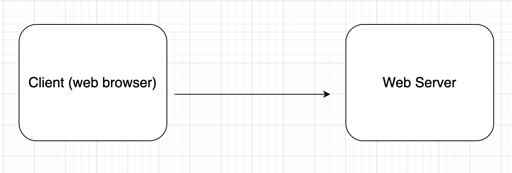
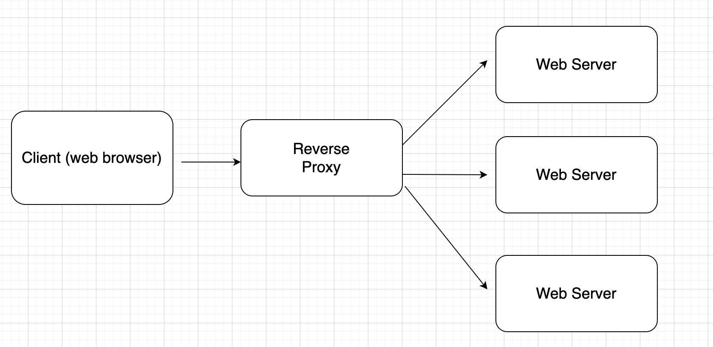
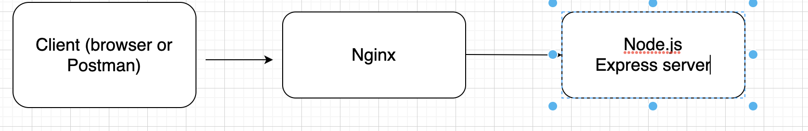

# 1. Docker + Nginx + NodeJs Project

### Goal

- Deploy a NodeJs app by using Docke and Nginx

### Resource

```
https://ashwin9798.medium.com/nginx-with-docker-and-node-js-a-beginners-guide-434fe1216b6b
```

### Concepts

**Nginx**

- Nginx is an open source **web server** that also sers as a **reverse proxy** and HTTP **load balancer**
- From the above definition we need to understand
  1. Web server
  2. Reverse proxy
  3. Load balancer

**Nginx is a web server**

- A web server is a piece of software that responsds to HTTP requests made by clients (usually web browsers). The web browser makes a request and the web server responds with a static content (usually HTML) corresponding to the request.

  

**Nginx is a reverse proxy**

- A reverse proxy is a server that sits in front of a group of web servers. when a browser makes an HTTP request, the request first goes to the reverse proxy which then sends the request to the appropriate web server.

  

- What are the benifits of reverse proxy?

  1. **Security**: with a reverse proxy, the web server never reveals its IP address to the client, which makes the server more secure.
  2. **SSL Encryption**: more security. Encrypting and decrypting SSL communication is expensive, and would make web servers slow. The reverse proxy can be configured to decrypt incoming requests from the client and encrypt outgoing responses from the server.
  3. **Load balancing**: If a web application has many users we can't depend on using only one web server, we need many web servers and we need a load balancer server whch will route each HTTP request of clients to different web servers.

### How to use Nginx as a reverse proxy for a local NodeJs server (with out Docker)

### Goal

- Demonstrate how Nginx can be used as a reverse proxy server for a simple Node.js server running locally

- The goal is to use Nginx infant of our NodeJS server, and instead of clients directly sending an HTTP request to our Node.js server, they will send their request the Nginx and Nginx will redirect their request to our server and it will get the response from our Node.js server and it will send it back to the client.

  

### Steps

1. **Create a simple Node.js server**

   ```
   npm init -y
   ```

   Create a basic Express.js app

   ```
   touch index.js
   npm install express
   ```

   Add a basic server code in `index.js`

   ```js
   const express = require("express");
   const app = express();
   app.get("/", (req, res) => {
     res.send("Hello World!");
   });
   app.listen(5000, () => console.log("Server is up and running"));
   ```

   Run the server

   ```
   node index.js
   ```

2. **Set up Nginx**

   - First to see what port Nginx is running on, you need to locate the default `nginx.conf` file, depending on the distribution the file could be located in any of the following paths:

     ```
     /etc/nginx/nginx.conf
     /usr/local/nginx/cong/nginx.conf
     /usr/local/etc/nginx/nginx.conf
     ```

   - The eaiset way to find the location of `nginx.conf` file is to run this command in your terminal

     ```
     nginx -t
     ```

   - The `nginx.conf` file looks like this

     ```nginx
     #user  nobody;
     worker_processes  1;
     ...
     http {
       include       mime.types;
       default_type  application/octet-stream;
       ...
       server {
         listen       80;
         server_name  localhost;
         ...
       }
       ...
       include servers/*;
     }
     ```

   - From this we can see the default port that nginx is running on

   - If you navigate to `http://localhost:80` in your browser you will see a message saying **Welcome to nginx**

3. **If nginx is not installed in your system install it**

   For Mac install it with brew and it will run on port `8080`

   ```
   brew install nginx
   ```

4. **Configure Nginx to be a reverse proxy for the Node.js app**

   - The concept here is that when the client sends an HTTP request to Nginx `http://127.0.0.1:8080`/`http://127.0.0.1:80`, this request will be redirected to our local nodejs server, `http:127.0.0.1:5000`.

   - For this we need to tell the `nginx.conf` file to listen to or to track to our nodejs server, as you see the last line has this piece of code.

     ```nginx
     include servers/*;
     ```

   - What this line does is tell Nginx to look inside the servers folder which is inside the nginx directory, this is where we will add our custom configuration.

   - Create a new file in the servers directory, and give it a name

     ```
     simple_node_server.conf
     ```

     ```
     cd servers
     touch simple_node_server.conf
     ```

   - Add this code to your new conf file

     ```nginx
     server {
             # this server listens on port 80
             listen 80 default_server;
             listen [::]:80 default_server;

             # name this server "nodeserver", but we can call it whatever we like
             server_name nodeserver;

             # the location / means that when we visit the root url (localhost:80/), we use this configuration
             location / {
                     # a bunch of boilerplate proxy configuration
                     proxy_http_version 1.1;
                     proxy_cache_bypass $http_upgrade;

                     proxy_set_header Upgrade $http_upgrade;
                     proxy_set_header Connection 'upgrade';
                     proxy_set_header Host $host;
                     proxy_set_header X-Real-IP $remote_addr;
                     proxy_set_header X-Forwarded-For $proxy_add_x_forwarded_for;
                     proxy_set_header X-Forwarded-Proto $scheme;

                     # the real magic is here where we forward requests to the address that the Node.js server is running on
                     proxy_pass http://localhost:5000;
             }
     }
     view raw
     ```

   - Most of the code is configuration code but the main code is the

     ```nginx
     proxy_pass http://localhost:5000
     ```

   - Here we are telling Nginx to redirect HTTP request coming in through port 80 to `http://localhost:5000`

   - Note that we can use Nginx with two Nodejs servers, if we have a nodejs server which is running on port `5000` and another on port `8000` we can use Nginx as a reverse proxy server to redirect the HTTP call of the client for the two servers we got.

5. Visit `localhost:80` and you will see the `Hello world` message

### Dockerizing a Node.js app with Nginx using Docker-compose

- Docker just makes things cleaner. If you Dockerize the application we just created in the previous section, there is no need to change the Nginx config on our local machine since we will have out own dedicated Nginx container running.

**Goal**

- Run Nginx in a Docker container

- Run The Node.js backend server in a Docker container

- Use the Nginx server which is running in a Docker container as a reverse proxy server for the Node.js server which is running in Docker.

  

### Steps

1. Create two folders in the root `app` and `nginx` so we can isolate the `nginx` server from the `node.js` server

2. Create a `Dockerfile`and a `.dockerignore` files for each servers

   Docker file for the node.js server

   ```dockerfile
   # pull the Node.js Docker image
   FROM node:alpine

   # create the directory inside the container
   WORKDIR /usr/src/app

   # copy the package.json files from local machine to the workdir in container
   COPY package*.json ./

   # run npm install in our local machine
   RUN npm install

   # copy the generated modules and all other files to the container
   COPY . .

   # our app is running on port 5000 within the container, so need to expose it
   EXPOSE 5000

   # the command that starts our app
   CMD ["node", "index.js"]
   ```

   `.dockerignore` file

   ```
   node_modules
   npm-debug.log
   ```

**Dockerizing the Nginx proxy**

- The goal is to have an instance of Nginx running inside a Docker container. just like the Nginx running in your local machine listens on a certain port, the Nginx instance will listen on a certain port inside the docker container.

1. Create a file named `default.conf` inside the nginx folder to store the configuration for the proxy.

   ```nginx
   server {
       location / {
           proxy_set_header Host $host;
           proxy_set_header X-Real-IP $remote_addr;
           proxy_set_header X-Forwarded-For $proxy_add_x_forwarded_for;
           proxy_set_header X-Forwarded-Proto $scheme;

           proxy_pass http://nodeserver:5001;
       }
   }
   ```

   - As you see in the above nginx config file we are proxying requests to `http://nodeserver:5001` instead of `localhost:5001`. This is a result of something we do with `docker-compose`.

2. Create a `Dockerfile` inside the nginx folder

   ```dockerfile
   FROM nginx
   COPY default.conf /etc/nginx/donf.d/default.conf
   ```

   - When running the `nginx` server locally the `default.conf` file was set to the `server` folder but there is not `servers` folder in the Docker distribution of Nginx, instead we have a folder called `conf.d`

### Using Docker compose to coordinate the containers

- Docker compose is a really useful tool that lets us spin up multiple containers with a single command. It also creates a common network between the containers that they can use to communicate with one another.

1. Create a file called `docker-compose.yml` that lists out what services make up that app and how we want to configure each container.

2. The docker-compose file will be comprised of two services: one for the Nodejs app and one for the Nginx server that is proxying requests to the Node.js app.

3. Add this code to the docker compose file

   ```yaml
   version: "3.8"
   services:
     nodeserver:
       build:
         context: ./app
       ports:
         - "5000:5000"
     nginx:
       restart: always
       build:
         context: ./nginx
       ports:
         - "80:80"
   ```

4. Run the `docker-compose` file

   ```
   docker-compose up --build
   ```

5. To run the containers in detached mode

   ```
   docker-compose up -d
   ```

6. Visit `localhost:80` in your browser and you should get a `hello world` message
